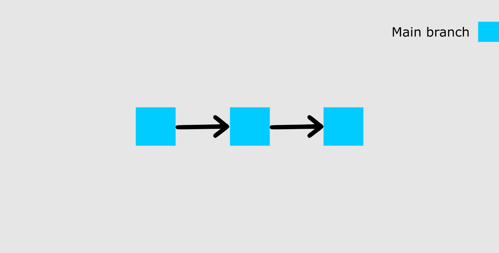

# Basic Git Concepts
## What is Git

Git is a version control system which lets you track changes you make to your files over time. With Git, you can revert to various states of your files (like a time traveling machine). You can also make a copy of your file, make changes to that copy, and then merge these changes to the original copy.

You are not limited to using Git just for source code files – you can also use it to keep track of text files or even images. This means that Git is not just for developers – anyone can find it helpful.

## Configuring Git

Check if you have git installed by running `git --version` on the command line.

To set your username, type and execute these commands: `git config --global user.name "YOUR_USERNAME"` and `git config --global user.email "YOUR_EMAIL"`. Just make sure to replace `"YOUR_USERNAME"` and `"YOUR_EMAIL"` with the values you choose.

## Initializing your Project

via command line move to your project's location and run `git init` This will tell Git to get ready to start watching your files for every change that occurs.
At first it is considered empty because we have not told Git what files to track. A repository is just another way to define a project being watched/tracked by Git.

## Git is NOT the same as GitHub

GitHub is an online hosting service for Git repositories. Imagine working on a project at home and while you are away, maybe at a friend's place, you suddenly remember the solution to a code error that has kept you restless for days.

You cannot make these changes because your PC is not with you. But if you have your project hosted on GitHub, you can access and download that project with a command on whatever computer you have access to. Then you can make your changes and push the latest version back to GitHub.

In summary, GitHub lets you store your repo on their platform. Another awesome feature that comes with GitHub is the ability to collaborate with other developers from any location.

## Pushing a repo to GitHub

- **Step 1:** Create a GitHub account
- **Step 2:** Create a Repository  
- **Step 3:** Add and Commit Files
- **Step 4:** Push the repository to GitHub

## File states

### Committed 
A file is in the committed state when all the changes made to the file have been saved in the local repo. Files in the committed stage are files ready to be pushed to the remote repo (on GitHub).
### Modified
A file in the modified state has some changes made to it but it's not yet saved. This means that the state of the file has been altered from its previous state in the committed state.
### Staged
A file in the staged state means it is ready to be committed. In this state, all necessary changes have been made so the next step is to move the file to the commit state.        

You can understand this better by imagining Git as a camera. The camera will only take a snapshot when the file reaches the commit state. After this state, the camera starts comparing changes being made to the same file with the last snapshot (this is the modified state). And when the required changes have been made, the file is staged and moved to the commit state for a new snapshot.

## How to add files in Git
When we first initialized our project, the file was not being tracked by Git. To do that, we use this command `git add .` The period or dot that comes after add means all the files that exist in the repository. If you want to add a specific file, maybe one named about.txt, you use `git add about.txt`.

Now our file is in the staged state. You will not get a response after this command, but to know what state your file is in, you can run the `git status command`.
## How to commit files in git

The next state for a file after the staged state is the committed state. To commit our file, we use the `git commit -m "first commit"` command.

The first part of the command git commit tells Git that all the files staged are ready to be committed so it is time to take a snapshot. The second part `-m "first commit" `is the commit message. `-m` is shorthand for message while the text inside the parenthesis is the commit message.

## Push the repo to GitHub

After you create the repo, you should be redirected to a page that tells you how to create a repo locally or push an existing one.

In our case, since we're practicing, the project already exists locally so we will use commands in the "…or push an existing repository from the command line" section. These are the commands:
`git remote add origin https://github.com/adagost/roadtoautomation` 

`git branch -M main`
  
`git push -u origin main`

The first command creates a connection between your local repo and the remote repo on GitHub.

The second command changes your main branch's name to "main". The default branch might be created as "master", but "main" is the standard name for this repo now.

The last command pushes your repo from your local device to GitHub.

## Making additional changes to a file
After making changes to the file, it moved to the modified state – but it's not yet staged for commit, so you can't push it to GitHub yet. Git has not taken a final snapshot of this current state as it's only comparing the changes we have made now with the last snapshot.

Now we are going to add (stage) this file and then commit and push it. This is the same as in the last section.

Those are the three steps to pushing your modified files to GitHub. You add, commit, and then push

## Branching
With branches, you can create a copy of a file you would like to work on without messing up the original copy. You can either merge these changes to the original copy or just let the branch remain independent.

The image above shows our main branch with the last two commits (the first commit and the new commit).

At this point, if I wanted to make new modifications but I'm not sure if I want them on my main file. So I can create a new branch called `test` to see what my file would look like with those mods.

To create a new branch, run this command: `git checkout -b test`

`checkout` tells Git it is supposed to switch to a new branch. `-b `tells Git to create a new branch. `test` is the name of the branch to be created and switched to.

Now that we have a new branch created, this is what our repo will look like:

We created the new branch from the state of our last commit. Let's add more stuff and merge the new state to the `main` branch. First, we have to stage and commit this branch.

After committing your test branch, switch back to the main branch by running this command: `git checkout main.`

This time around we did not add `-b` because we are not creating a new branch.

Now we can merge the changes we made in the test branch into the main branch by running `git merge test`

####Sources: 
- https://www.freecodecamp.org/news/git-and-github-for-beginners/
- https://www.tutorialspoint.com/git/git_basic_concepts.htm
